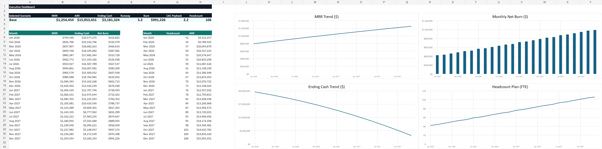

# FP&A Scenario Planning Model in Excel

## Goal

Build an executive-ready SaaS FP&A workbook that forecasts revenue, expenses, cash flow, burn rate, runway, CAC payback, and key operating metrics under base, upside, and downside scenarios.

## Business Problem

Leadership needs to understand how long the business can operate under different growth and cost assumptions. The model answers:

> Given current cash, revenue, churn, acquisition spend, hiring plan, and operating expenses, what happens to MRR, ARR, burn, and runway over the next 24 months?

## Why This Project Is Portfolio-Grade

This is not a simple spreadsheet dashboard. It demonstrates how a senior analyst or FP&A partner builds a refreshable, auditable, decision-useful workbook:

- Scenario selector for Base, Upside, and Downside cases
- Monthly SaaS revenue forecast driven by customers, ARPA, churn, expansion, and new logos
- Hiring plan integrated into payroll and operating expense forecasts
- Cash flow roll-forward with burn rate and runway calculation
- Sensitivity analysis for growth and churn assumptions
- Dashboard with executive KPIs and charts
- Validation checks for scenario selection, formula integrity, revenue roll-forward, and cash roll-forward
- Python-based workbook generation for reproducibility

## Workbook Tabs

- `README`: model purpose, layout, and operating instructions
- `Assumptions`: scenario-level growth, churn, ARPA, gross margin, CAC, opex, and starting cash assumptions
- `Historical Actuals`: monthly actual MRR, customers, ARR, gross margin, opex, burn, and cash
- `Hiring Plan`: monthly headcount plan by function
- `Scenario Controls`: selected scenario and active assumption lookup
- `Revenue Forecast`: formula-driven monthly SaaS revenue model
- `Expense Forecast`: payroll, sales and marketing, G&A, R&D, and total opex forecast
- `Cash Flow`: gross profit, burn, ending cash, and runway forecast
- `Sensitivity Analysis`: runway sensitivity by growth and churn combinations
- `Dashboard`: executive-facing KPI cards and charts
- `Validation Checks`: workbook controls and pass/fail status

## Key Metrics

- Monthly Recurring Revenue (MRR)
- Annual Recurring Revenue (ARR)
- Net Revenue Retention (NRR)
- Gross Margin
- Burn Rate
- Ending Cash
- Cash Runway
- CAC Payback
- Headcount

## How To Rebuild

Run the workbook builder from the project root:

```powershell
node scripts\build_workbook.mjs
```

The generated workbook is saved to:

```text
model/fpa_scenario_planning_model.xlsx
```

Validate the generated workbook:

```powershell
node scripts\validate_model.mjs
```

## Technology

Excel, formulas, scenario modeling, financial forecasting, FP&A dashboard design, Python-style data generation concepts implemented through JavaScript workbook automation, and `@oai/artifact-tool` for reproducible workbook creation.

## Results

- Built a 24-month SaaS FP&A model with scenario-driven revenue, expense, cash flow, and runway logic.
- Added validation checks so model integrity is visible inside the workbook.
- Created executive-ready dashboard outputs with KPI cards and charts.
- Packaged source inputs, methodology notes, and workbook-generation code for auditability.

## Dashboard Preview


