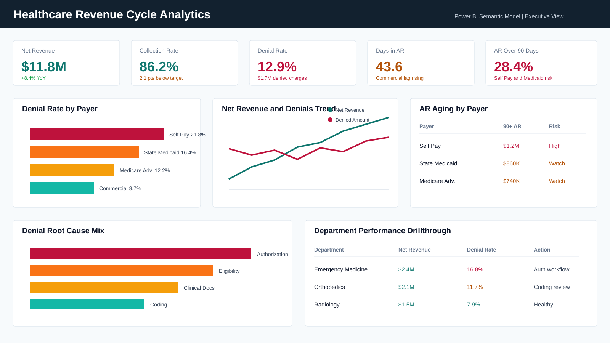

# Healthcare Revenue Cycle Analytics in Power BI

## Goal

Build a Power BI portfolio project that models hospital revenue cycle performance across claims, payments, denials, accounts receivable, payer mix, departments, providers, and denial root causes.

## Business Problem

Healthcare finance and revenue cycle teams need a governed reporting layer that answers:

- Which payers and departments are driving denied charges?
- How much revenue is delayed in accounts receivable?
- Which denial reasons are preventable and financially material?
- Are collection rate, clean claim rate, denial rate, and days in AR improving?
- Which provider or department workflows should leadership prioritize?

## Why This Project Is Portfolio-Grade

This project is designed to show senior Power BI skills beyond chart building:

- Star schema with claims, payments, denials, AR snapshots, and conformed dimensions
- Governed semantic model with explicit relationships and a dedicated DAX measure layer
- Time intelligence for prior period, YoY, and rolling trend analysis
- Revenue cycle KPIs including collection rate, denial rate, clean claim rate, first-pass resolution, AR over 90 days, reimbursement lag, and payer mix
- Drillthrough design from executive KPIs to payer, department, provider, claim, and denial details
- Row-level security design for regional finance leaders and department managers
- Power Query cleaning steps, data dictionary, validation script, and dashboard build guide
- Portfolio-ready mockup image for GitHub and the personal website

## Project Structure

```text
Healthcare Revenue Cycle Analytics in Power BI/
  README.md
  data/
    dim_date.csv
    dim_patient_masked.csv
    dim_provider.csv
    dim_department.csv
    dim_payer.csv
    dim_procedure.csv
    dim_denial_reason.csv
    fact_claims.csv
    fact_payments.csv
    fact_denials.csv
    fact_ar_snapshot.csv
  scripts/
    generate_revenue_cycle_data.py
    validate_model.py
  powerbi/
    data_model.md
    dax_measures.md
    power_query_steps.md
    dashboard_build_guide.md
    dashboard_spec.md
    rls_roles.md
    powerbi_service_link.txt
  docs/
    data_dictionary.md
    methodology.md
  outputs/
    dashboard_mockup.svg
```

## Dashboard Pages

### Executive Overview

Leadership view of net revenue, collection rate, denial rate, days in AR, AR over 90 days, payer mix, revenue trends, and department performance.

### Denials Root Cause

Denial analytics by payer, denial category, denial reason, preventability, department, provider, appeal status, and recovered amount.

### AR Aging

Accounts receivable balance by aging bucket, payer, department, claim age, and over-90-day exposure.

### Provider and Department Performance

Operational performance by department and provider, including net revenue, clean claim rate, denial rate, average reimbursement lag, and write-off rate.

### Claim Detail Drillthrough

Claim-level investigation page for selected payer, provider, department, claim status, denial reason, and AR bucket.

## Power BI Workflow

1. Open Power BI Desktop.
2. Use `Get Data -> Text/CSV` to load every file in `data/`.
3. Apply the cleanup steps in `powerbi/power_query_steps.md`.
4. Create the relationships documented in `powerbi/data_model.md`.
5. Create a dedicated `Measures` table.
6. Copy measures from `powerbi/dax_measures.md`.
7. Build pages using `powerbi/dashboard_build_guide.md`.
8. Configure RLS roles from `powerbi/rls_roles.md`.
9. Publish to Power BI Service or export a portfolio screenshot.
10. Paste the published URL into `powerbi/powerbi_service_link.txt`.

## Technology

Power BI Desktop, Power Query, DAX, star schema modeling, CSV data generation, Python validation, row-level security, dashboard storytelling, healthcare revenue cycle analytics.

## Results

- Generated a validated healthcare revenue cycle dataset with 9,000 claims, 7,324 payments, 1,275 denials, and 2,062 AR snapshot rows.
- Designed a Power BI semantic model with fact tables for claims, payments, denials, and AR snapshots plus conformed date, payer, provider, department, procedure, patient, and denial reason dimensions.
- Defined a DAX measure layer covering gross charges, allowed amount, net revenue, collection rate, denial rate, clean claim rate, first-pass resolution rate, days in AR, AR over 90 days, payer mix, reimbursement lag, write-off rate, and rolling trend metrics.
- Documented report pages, drillthrough paths, Power Query transformations, RLS roles, and portfolio publication workflow.

## Dashboard Mockup


