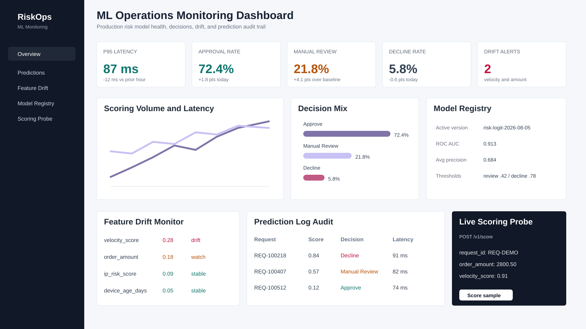

# ML Operations Monitoring Dashboard

## Goal

Build a frontend monitoring dashboard for the `Production ML Risk Scoring API`, showing model health, scoring volume, latency, decision distribution, feature drift, prediction audit logs, model registry metadata, and a live scoring probe.

## Business Problem

Machine learning systems need more than model accuracy. Product, risk, and platform teams need a UI that can answer:

- Is the scoring API healthy?
- Are latency and traffic within operating bounds?
- Are approve, manual-review, and decline rates shifting?
- Which features are drifting?
- Which requests were scored by which model version?
- What are the top factors behind high-risk predictions?
- Can an operator run a safe sample scoring probe?

This project is the frontend companion to the backend MLE service.

## Why This Project Is Portfolio-Grade

This project demonstrates frontend engineering for an ML product surface:

- React + TypeScript app built with Vite
- Componentized dashboard architecture
- API client for the FastAPI risk scoring backend
- Live scoring probe that calls `/v1/score`
- Responsive dashboard layout for desktop and mobile
- SVG-based charts without heavy visualization dependencies
- Operational UI patterns: KPI cards, decision mix, drift table, prediction logs, model registry, alert states
- Production-oriented copy and states instead of a generic landing page
- Documentation for API integration, component architecture, and product requirements

## Project Structure

```text
ML Operations Monitoring Dashboard/
  README.md
  package.json
  tsconfig.json
  vite.config.ts
  index.html
  src/
    App.tsx
    main.tsx
    styles.css
    api/
      riskApi.ts
    components/
      DecisionMix.tsx
      DriftTable.tsx
      KpiCard.tsx
      LineChart.tsx
      ModelRegistry.tsx
      PredictionTable.tsx
      ScoreConsole.tsx
    data/
      mockData.ts
    utils/
      format.ts
    types.ts
  docs/
    architecture.md
    api_integration.md
    product_requirements.md
  outputs/
    dashboard_preview.svg
```

## Local Run

```powershell
cd "ML Operations Monitoring Dashboard"
npm install
npm run dev
```

The app runs on:

```text
http://127.0.0.1:5174
```

## Backend Integration

The dashboard can run with mock data by default. The live scoring probe calls the backend API:

```text
http://127.0.0.1:8000/v1/score
```

Configure with:

```text
VITE_RISK_API_BASE_URL=http://127.0.0.1:8000
VITE_RISK_API_KEY=dev-local-key
```

## Technology

React, TypeScript, Vite, CSS Grid, SVG charts, lucide-react icons, REST API integration.

## Results

- Built a product-style ML monitoring dashboard for the production risk scoring backend.
- Added operational views for latency, request volume, decision mix, feature drift, model registry metadata, and prediction audit logs.
- Implemented a live scoring probe that can call the FastAPI backend with a sample transaction.
- Created responsive components and a polished enterprise UI suitable for a machine learning platform portfolio.

## Dashboard Preview



