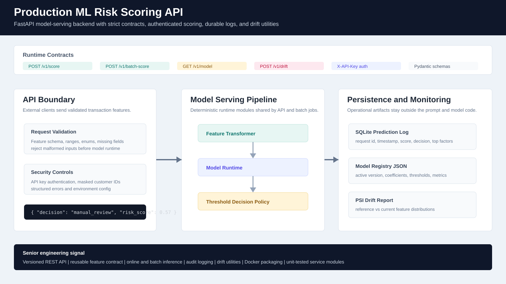

# Production ML Risk Scoring API

## Goal

Build a production-style machine learning backend that serves real-time transaction risk scores, supports batch scoring, logs predictions for auditability, exposes model registry metadata, and includes drift monitoring patterns.

## Business Problem

Risk, fraud, credit, marketplace, and trust-and-safety teams often need a scoring service that can:

- Score a transaction in milliseconds.
- Return both a probability and an operational decision.
- Validate incoming features before model inference.
- Log predictions for monitoring, audit, and later model evaluation.
- Support batch backfills and analyst workflows.
- Track model version, thresholds, training metrics, and drift indicators.
- Expose a stable API contract for product and frontend teams.

This project demonstrates the backend layer that turns a trained model into a reliable product service.

## Why This Project Is Portfolio-Grade

This is intentionally more than a notebook or a simple `predict()` endpoint:

- FastAPI service with versioned online and batch scoring endpoints
- Pydantic request/response schemas for feature contract enforcement
- Deterministic model artifact loaded from a registry file
- Model version, thresholds, and training metrics stored separately from code
- Feature transformation layer shared by API, batch scoring, and tests
- SQLite prediction log for local demos, with a schema that maps cleanly to PostgreSQL
- API key authentication
- Batch scoring CLI
- Drift monitoring utilities using Population Stability Index
- Docker and Docker Compose for reproducible local serving
- Unit tests for feature validation, model behavior, and drift metrics
- Documentation for architecture, API contract, monitoring, and deployment

## Project Structure

```text
Production ML Risk Scoring API/
  app/
    main.py              FastAPI app and route wiring
    schemas.py           Pydantic API contracts
    features.py          Feature validation and transformation
    model.py             Model artifact loader and scoring runtime
    scoring.py           Decision policy and explanation wrapper
    storage.py           SQLite prediction logging
    drift.py             PSI drift metrics
    batch.py             Batch scoring utility
    security.py          API key guard
    config.py            Environment-based settings
  artifacts/
    model_registry.json
  data/
    reference_features.csv
    batch_scoring_input.csv
  docs/
    architecture.md
    api_contract.md
    monitoring.md
    deployment.md
    model_card.md
  outputs/
    api_architecture_mockup.svg
  scripts/
    generate_assets.py
    run_batch_score.py
  tests/
    test_features.py
    test_model.py
    test_drift.py
  Dockerfile
  docker-compose.yml
  requirements.txt
  .env.example
```

## Local Run

```powershell
cd "Production ML Risk Scoring API"
python -m venv .venv
.\.venv\Scripts\Activate.ps1
python -m pip install -r requirements.txt
uvicorn app.main:app --reload
```

Health check:

```powershell
Invoke-RestMethod http://127.0.0.1:8000/health
```

Score one request:

```powershell
$headers = @{ "x-api-key" = "dev-local-key" }
$body = @{
  request_id = "REQ-DEMO-0001"
  customer_id = "CUST-12345"
  customer_segment = "consumer"
  channel = "mobile"
  account_age_days = 12
  prior_transactions_30d = 27
  prior_chargebacks_180d = 2
  failed_payment_attempts_24h = 4
  order_amount = 2800.50
  shipping_distance_km = 1200
  device_age_days = 3
  email_domain_age_days = 15
  ip_risk_score = 0.82
  billing_shipping_match = $false
  velocity_score = 0.91
} | ConvertTo-Json

Invoke-RestMethod `
  -Method Post `
  -Uri http://127.0.0.1:8000/v1/score `
  -Headers $headers `
  -Body $body `
  -ContentType "application/json"
```

Batch scoring:

```powershell
python scripts/run_batch_score.py --input data/batch_scoring_input.csv --output data/batch_scoring_output.csv
```

Run tests:

```powershell
python -m pytest
```

## API Endpoints

| Method | Path | Purpose |
|---|---|---|
| `GET` | `/health` | Service and model version health check |
| `POST` | `/v1/score` | Real-time risk scoring |
| `POST` | `/v1/batch-score` | Score a CSV file from the backend runtime |
| `GET` | `/v1/prediction-summary` | Prediction log summary |

## Technology

Python, FastAPI, Pydantic, SQLite, Docker, Docker Compose, pytest, deterministic model artifacts, API key auth, batch scoring, drift monitoring.

## Results

- Built a versioned real-time risk scoring API with strict request/response contracts.
- Implemented a reusable feature transformation layer shared by online scoring, batch scoring, and tests.
- Added prediction logging with masked customer identifiers for auditability and monitoring.
- Added model registry metadata for active version, coefficients, thresholds, and training metrics.
- Added batch scoring and drift monitoring utilities that represent common MLOps production workflows.
- Packaged the service with Docker, documentation, and tests so it can be reviewed as an engineering system rather than a notebook.

## API Architecture Mockup


