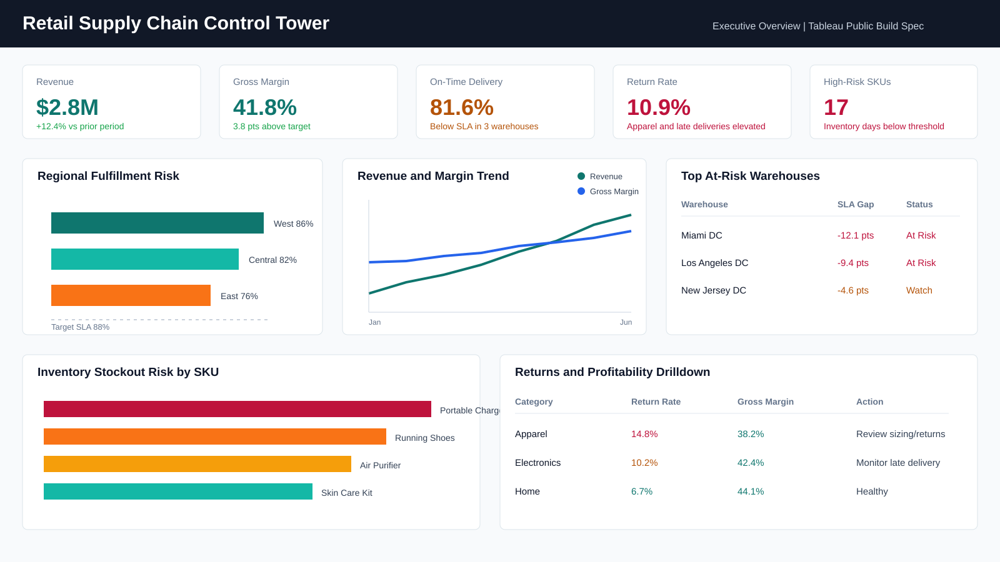

# Retail Supply Chain Control Tower in Tableau

## Goal

Build a Tableau-ready retail supply chain analytics project that monitors fulfillment SLA, warehouse performance, inventory risk, return rates, and SKU profitability.

## Business Problem

Retail operations leaders need a control tower view that answers:

- Which regions and warehouses are driving late shipments?
- Which SKUs are at risk of stockout?
- Which categories have high revenue but low profitability?
- Where are return rates rising?
- Which operational bottlenecks need immediate action?

## Why This Project Is Portfolio-Grade

This project is designed to showcase senior Tableau and BI skills:

- Multi-table Tableau data model across orders, shipments, inventory, returns, and warehouse targets
- KPI definitions for SLA, fill rate, return rate, gross margin, and stockout risk
- Tableau calculated fields and LOD-style metrics
- Parameter-driven metric selection and SLA thresholding
- Drilldown path from region to warehouse to SKU to order detail
- Executive overview and operations-focused dashboard design
- Tableau-ready synthetic datasets with validation checks
- Dashboard build guide that can be implemented in Tableau Public

## Project Structure

```text
Retail Supply Chain Control Tower in Tableau/
  README.md
  data/
    orders.csv
    shipments.csv
    inventory.csv
    returns.csv
    warehouse_targets.csv
  scripts/
    generate_supply_chain_data.py
    validate_data.py
  tableau/
    calculated_fields.md
    dashboard_build_guide.md
    dashboard_spec.md
    tableau_public_link.txt
  docs/
    data_dictionary.md
    methodology.md
  outputs/
    dashboard_mockup.svg
```

## Dashboard Pages

### Executive Overview

Shows revenue, gross margin, on-time delivery rate, return rate, stockout-risk SKU count, and top problem regions.

### Fulfillment Performance

Compares warehouse SLA, late shipment rate, average fulfillment days, carrier performance, and regional delivery risk.

### Inventory Risk

Ranks SKUs by days of inventory remaining, reorder flag, fill rate, demand velocity, and stockout risk score.

### Returns & Profitability

Analyzes return rate by category, gross margin by SKU, return reasons, and high-revenue / low-margin products.

### Drilldown

Supports region to warehouse to SKU to order-level investigation.

## Tableau Public Workflow

Published dashboard: [Retail Supply Chain Control Tower](https://public.tableau.com/app/profile/emily.qiu6817/viz/RetailSupplyChainControlTower/ExecutiveOverview?publish=yes)

1. Open Tableau Public.
2. Connect to `data/orders.csv`.
3. Add `shipments.csv`, `inventory.csv`, `returns.csv`, and `warehouse_targets.csv`.
4. Create relationships using the keys documented in `docs/data_dictionary.md`.
5. Add calculated fields from `tableau/calculated_fields.md`.
6. Build dashboards using `tableau/dashboard_build_guide.md`.
7. Publish to Tableau Public.
8. Paste the published URL into `tableau/tableau_public_link.txt`.

## Technology

Tableau Public, Tableau calculated fields, CSV data modeling, Python synthetic data generation, business KPI design, operational analytics, dashboard storytelling.

## Results

- Created a Tableau-ready retail operations dataset with validated order, shipment, inventory, return, and target tables.
- Defined senior BI metrics such as on-time delivery rate, warehouse SLA gap, fill rate, gross margin, return rate, inventory days remaining, and stockout risk score.
- Published an executive control tower dashboard and drilldown workflow for supply chain leaders.
- Packaged calculated fields, dashboard specifications, and build instructions for Tableau Public implementation.

## Dashboard Mockup


